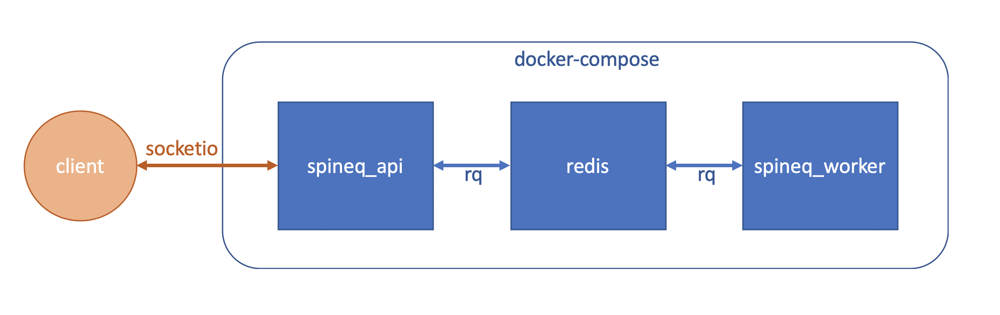

# Optimisation Backend

## Infrastructure

The optimisation backend is currently set up in docker compose (`docker-compose.yml` in the root of the repo) with the following containers:



- **spineq_api**
  - Flask and Flask-SocketIO API for submitting, getting or deleting optimisation jobs.
  - Image: `Dockerfile` in the root of the repo.
  - Command: Runs app defined in `api/app.py` with `gunicorn`. Normal flask endpoints as well as a socketio interface (see below).
  - Flask-SocketIO docs: https://flask-socketio.readthedocs.io/en/latest/

- **redis**
  - Redis server: Stores a queue of optimisation jobs and the results of those jobs.
  - Image: Official redis image on Dockerhub (https://hub.docker.com/_/redis/)
  - Redis docs: https://redis.io/

- **spineq_worker**
  - Runs optimisation jobs taken from the redis queue.
  - Image: `Dockerfile` in the root of the repo.
  - Command: Runs `api/worker.py` which starts a RQ worker (see below) that looks for jobs queued on the redis server.


### Overview

The Redis server is used to give a mechanism for supporting background jobs. The API provides a function to submit jobs to the redis server and quickly returns the ID of the job to the client, without having to wait for the optimisation job to complete. In the background the worker picks up queued jobs from the server and processes them. Once the job has finished the client is either automatically notified of the result (socketio) or the client can submit another API request to receive the results.

All communication between the API (Flask app), Redis server and the worker is handled by the python package RQ (https://python-rq.org/). With the current "homemade" greedy algorithm used in the optimisation it is possible to update the job with metadata describing its progress, which is also done with RQ.


## Starting the Optimisation Backend

### Run Locally

(Assuming you have docker installed and running)

From the root of the repo:

```bash
docker-compose up
```

The API should then be available on `0.0.0.0:5000` (will display a basic homepage if you open it in a browser).

If something didn't build/update correctly, running docker compose with these flags may help:
```bash
docker-compose up --build --force-recreate
```

### Azure Deployment

The optimisation backend is also available at:
https://optimisation-backend.azurewebsites.net/

This is using the App Service `optimisation-backend` in the `decision-support-optimisation-backend` resource group in our Azure subscription. The contents of `docker-compose.yml` are pasted into the `Container settings` with modifications to pull the container image from DockerHub (https://hub.docker.com/repository/docker/jack89roberts/spatial-inequality-backend). The app service should automatically rebuild if the image on docker hub is updated, and the DockerHub image should rebuild if anything is pushed to master in this repo (**NB: So be careful about commiting to master!** )


## Using the API

### SocketIO Endpoints

SocketIO (https://socket.io/) is one implementation of getting bi-directional communication between a client and a server, and is implemented in the API with flask-socketio (https://flask-socketio.readthedocs.io/en/latest/). Both the client and server can emit and receive events. The pipeline for an optimisation job submitted to the API with socketio is:

1) Client emits optimisation job.
2) Server receives job and adds it to the Redis server.
3) Worker pulls job from the Redis queue and processes it.
4) Once job has finished, Server emits the result.
5) Client receives the result.

The main benefit is that the client submits an optimisation job and automatically receives the result once it is ready without having to make another API call. A summary of the different API endpoints and their parameters is given below. The script `scripts/client.py` shows a simple example of interaction with the API using a python SocketIO client.

Endpoints:
* Submit an optimisation job:
  - Client emits event `submitJob` with data `{"n_sensors": 10, "theta": 500}`
  - Server emits event `job` with job data.
  - On job completion, server emits `jobFinished` with job_id and result.
  - Optionally can give the following parameters with `submitJob`:
    - `min_age`: Minimum age to include for population coverage (default: 0)
    - `max_age`: Maximum age to include for population coverage (default: 90)
    - `population_weight`: Weight for population coverage (default: 1)
    - `workplace_weight`: Weight for place of work coverage (default: 0)
  
* Retrieve the result/status of a job:
  - Client emits event `getJob` with data `<the_job_id>`
  - Server emits event `job` with job data.

* Get a list of available job IDs on the Redis server:
  - Client emits event `getQueue`
  - Server emits event `queue` with queue data.
  
* Remove a job from the queue:
  - Client emits event `deleteJob` with data `<the_job_id>`
  - Server emits event `message` with deletion result.
  
* Remove all jobs from the queue:
  - Client emits event `deleteQueue`
  - Server emits event `message` with deletion result.

### Normal Endpoints

As well as the SocketIO endpoints `api/app.py` also defines normal `Flask` endpoints which you can interact with in a browser, curl or whatever your preferred tool is. The homepage (`0.0.0.0:5000` if running locally) gives some examples of basic usage. The endpoints are:

- Submit optimisation job: `/optimise` with parameters `n_sensors`, `theta`, `min_age`, `max_age`, `population_weight` and `workplace_weight`. E.g. `/optimise?n_sensors=5&theta=500`
- Get a job from the queue: `/job/<job_id>`
- List all jobs on the redis server: `/queue`
- Delete all jobs from the redis server: `/queue/deleteall`
- Delete one job from the redis server: `/queue/delete/<job_id>`


## Possible Future Work

### Cache of Previous Results

Currently the Redis server is configured to preserve jobs for 24 hours, after which they are lost and can't be recovered. A nice feature to have would be a database of previous optimisation results. If a user submits a new job with the same (or even similar) parameters as one that already exists in the database they could be served the results of the previous run without having to wait for an optimisation to finish.

### Deployment Infrastructure

The current app service is slow. It would be nice to look into:
- Making it faster.
- Processing multiple jobs concurrently (this should also be possible with the current infrastructure - simply adding more `spineq_worker` containers to docker compose should work, for example. Alternatively, run multiple workers in the same container).
- Scaling/spinning up and down hardware as required to save costs.

Aside from just scaling up the App Service, options may include:
- Azure Batch: https://docs.microsoft.com/en-us/azure/batch/ - autoscaling pool of VMs to submit jobs to.
- Kubernetes: https://kubernetes.io/docs/concepts/overview/what-is-kubernetes/ and Azure Kubernetes Service: https://docs.microsoft.com/en-us/azure/aks/

### Improve API

The current Flask/Flask-SocketIO API works but is very basic and doesn't feel particularly robust. There may be other frameworks or Flask plugins that could be used to autogenerate docs pages, deal with adding arguments/structuring returned objects in a standard way and so on. One option I've come across is FastAPI: https://fastapi.tiangolo.com/